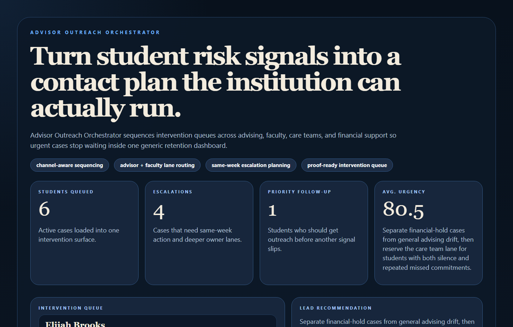
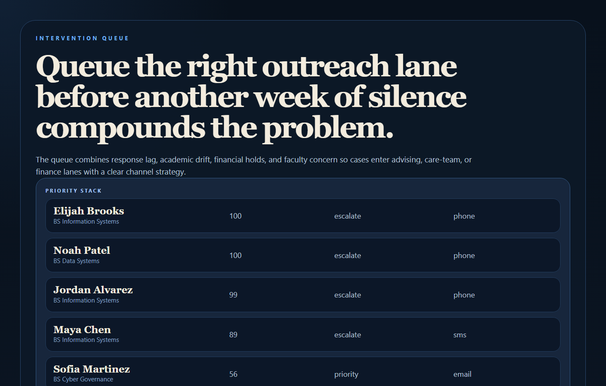
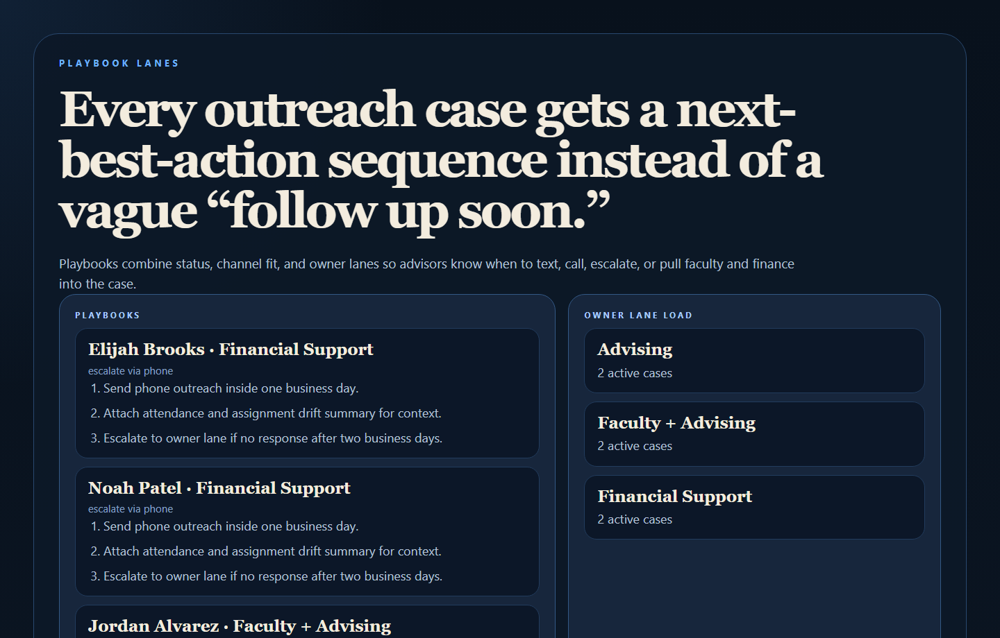
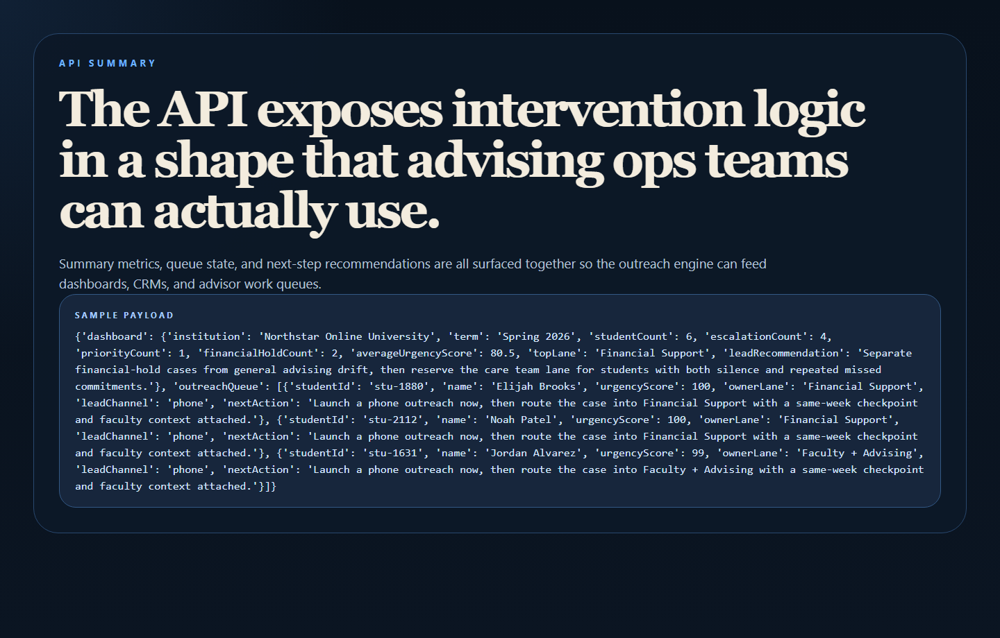

# Advisor Outreach Orchestrator

Advisor Outreach Orchestrator is an EdTech workflow engine for sequencing advisor interventions across advising, faculty, care teams, and financial support. It turns response lag, assignment drift, attendance changes, and hold status into a prioritized outreach queue with channel-aware next steps.



## Why this repo is good

- It completes the EdTech action layer after `student-success-signal-hub` and `curriculum-knowledge-graph`.
- It shows workflow orchestration, not just analytics: who should act, how, and when.
- It stays commercially legible for student success teams, advising operations, and higher-ed platform work.

## What it does

- Scores outreach urgency from academic drift, silence, no-show history, and support barriers.
- Routes cases into owner lanes like Advising, Faculty + Advising, Financial Support, and Care Team.
- Chooses a lead communication channel based on urgency and student context.
- Generates next-best-action playbooks instead of generic follow-up recommendations.

## Proof





## Local run

```powershell
cd advisor-outreach-orchestrator
py -3.11 -m venv .venv
.\.venv\Scripts\python.exe -m pip install -r requirements.txt
.\.venv\Scripts\python.exe -m app.main
```

Open:

- `http://127.0.0.1:4728/`
- `http://127.0.0.1:4728/queue`
- `http://127.0.0.1:4728/playbooks`
- `http://127.0.0.1:4728/docs`

## Validation

```powershell
.\.venv\Scripts\python.exe -m unittest discover -s tests
.\.venv\Scripts\python.exe scripts\run_demo.py
.\.venv\Scripts\python.exe scripts\smoke_check.py
.\.venv\Scripts\python.exe scripts\render_readme_assets.py
```

## API shape

Endpoints:

- `/api/dashboard/summary`
- `/api/queue`
- `/api/lanes`
- `/api/students/{student_id}`
- `/api/sample`

Sample output:

```json
{
  "dashboard": {
    "institution": "Northstar Online University",
    "term": "Spring 2026",
    "studentCount": 6,
    "escalationCount": 3,
    "priorityCount": 2
  }
}
```

## Repo layout

```text
app/
  data/
  services/
docs/
scripts/
screenshots/
tests/
```
